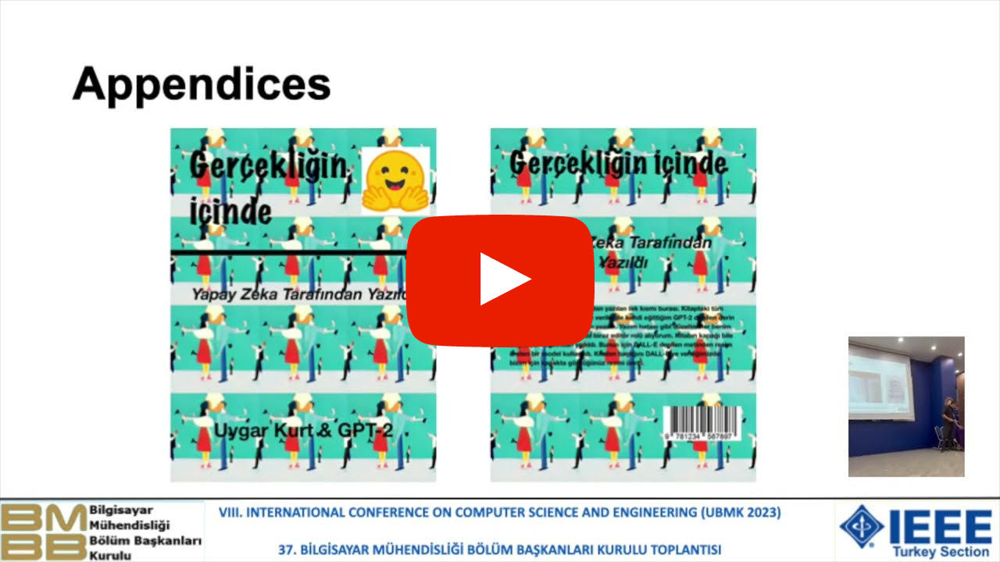

# A Modern Turkish Poet: Fine-Tuned GPT-2

<div align="center"> 
    <a href="https://en.wikipedia.org/wiki/Open_source">
        
    </a>
    <a href="https://ieeexplore.ieee.org/document/10286720">
        
    </a>
    <a href="https://en.wikipedia.org/wiki/MIT_License">
        
    </a>
</div>

<br/>
<div align="center">
    <p>Liked our work? give us a ⭐!</p>
</div>

This repository contains the PDF version of the book **Gerçekliğin İçinde: Yapay Zeka Tarafından Yazıldı** that is written by custom fine-tuned GPT-2. In total 5 GPT-2 models trained for 5 different chapters. This book contains 70 poems, 10 for each chapter, and published at [Amazon](https://www.amazon.com/gp/product/B0BKWMFB3V/ref=x_gr_bb_amazon?ie=UTF8&tag=x_gr_bb_amazon-20&linkCode=as2&camp=1789&creative=9325&creativeASIN=B0BKWMFB3V&SubscriptionId=1MGPYB6YW3HWK55XCGG2), [Goodreads](https://www.goodreads.com/book/show/75427836-ger-ekli-in-i-inde?ac=1&from_search=true&qid=tY5OinoPzb&rank=1) and [Google Books](https://books.google.com.tr/books/about/Gerçekliğin_İçinde.html?id=gumYEAAAQBAJ&redir_esc=y). 

This work presented in the paper  [A Modern Turkish Poet: Fine-Tuned GPT-2](https://ieeexplore.ieee.org/document/10286720). This paper got accepted from UBMK23. Aim of this work is to push the limits of AI to convey human emotions on different topics.

### YouTube Presentation
This paper also contains a corresponding presentation published on YouTube with the title **A Modern Turkish Poet: Fine-Tuned GPT-2 - Paper Presentation**

[](https://www.youtube.com/watch?v=963Yc1FApHw&t=10s)

## Table of Contents
* [Chapters](#chapters)
* [Sample Poems](#sample)
    * [Chapter 1](#chapter1)
    * [Chapter 2](#chapter2)
    * [Chapter 3](#chapter3)
    * [Chapter 4](#chapter4)
    * [Chapter 5](#chapter5)
* [Data](#Data)
* [Contact](#contact)
* [Citation](#citation)

## Chapters <a class="anchor" id="chapters"></a>
Below you can view the chapters with main motives and related categories.

| Chapter # | Motive      | Categories                                   |
|-----------|-------------|----------------------------------------------|
| Chapter 1 | Love        | pain, love, depression, separation, yearning |
| Chapter 2 | Nature      | tree, peace, heaven, environment, flower     |
| Chapter 3 | Religion    | after-life, justice, god, religion, heaven   |
| Chapter 4 | Nationalism | martyr, family, courage, mother, father      |
| Chapter 5 | Youth       | youth, holiday, travel, time, happiness      |

## Sample Poems <a class="anchor" id="sample"></a>
Below you can find a sample poem for each chapter.

### Chapter 1 - Love <a class="anchor" id="chapter1"></a>
Ben sende kayboldum bir tanem. \
Sen bende kayboldun. Beni terk et artık... Beni sen öldürdün. \
Yürekte senden hatıra kalsın. Bu hasretlik beni boğmasın. Ne olursun yar! \
Ne diyebilesin? Yalnız olan sen...

### Chapter 2 - Nature <a class="anchor" id="chapter2"></a>
Bahar gelip döküldüğünde yapraklar, \
Gül açar sana, o güzel baharda Meyveler yeşerir, çiçek açar dallara, yapraklara \
O baharda kokusu var ya!
Bir çiçek soldurur.
O an, ne güzel sensiz!

### Chapter 3 - Religion <a class="anchor" id="chapter3"></a>
Bulutların üzerinde cenneti görebiliyorum. \
Sessiz cennet kokusu \
Olmazsa eğer bir yıldızım. \
Benim öyle bir isteğim var ise \
Seni bu gece yalnız bırakacağım! \
\
Tanrı bana ne verdi, ne götüreyim! \
Ben sana, en çok sana güvendim. \
Bu ne demek diye bana dua etti. \
Ben bu yüzden sana soruyorum. \
Tanrı'dan başka ne gelir ki...

### Chapter 4 - Nationalism <a class="anchor" id="chapter4"></a>
Düşmanı öldürdüm oldum kahraman \
Uşağıma vurdum ben anlı şanlı bayrağım uğruna \
Bu vatan için yandım diye öldüm. \
Öleyim Allah’ım ben bu Vatan uğruna,..

### Chapter 5 - Life <a class="anchor" id="chapter5"></a>
Yüreğim aklım hep uzaklarda. \
Belki de ben 'Unutmayacağım bunu!' \
Dediğin şeylere bir göz atıyorum \
Biraz da özlem ''Nostalji'' olsun diye \
\
En güzel tatil yeri neresi diye soracaktım \
Bilmiyorum, bulamadım.
O gün içinize bir şey bulamıyorum. \
Çünkü ben bir gün önce uyuyamaştım biliyorsun. \
Annemi fazla kafama taktım sanırım.. \
\
En son gündü ve ben ilk defa öldüğüm için. \
Yine de özlemişimin son demindeyim.

## Data <a class="anchor" id="data"></a>
All the categories and number of poems for each category has summarized below.

| Category    | \# Poems | Category   | \# Poems | Category | \# Poems |
|-------------|----------|------------|----------|----------|----------|
| pain        | 996      | nature     | 917      | earth    | 1082     |
| love        | 858      | sky        | 914      | time     | 897      |
| depression  | 359      | sunset     | 1007     | worry    | 959      |
| separation  | 865      | sun        | 892      | sin      | 986      |
| yearning    | 896      | beauty     | 838      | belief   | 1074     |
| memory      | 959      | life       | 847      | martyr   | 1019     |
| sorrow      | 974      | bird       | 957      | family   | 897      |
| silence     | 923      | scenery    | 930      | courage  | 911      |
| complaint   | 872      | happiness  | 832      | mother   | 914      |
| sadness     | 973      | joy        | 990      | father   | 915      |
| farewell    | 962      | dream      | 971      | flag     | 908      |
| loneliness  | 948      | hope       | 866      | soldier  | 868      |
| cry         | 936      | after-life | 1040     | hero     | 865      |
| longing     | 794      | justice    | 947      | war      | 838      |
| tree        | 974      | god        | 896      | homeland | 935      |
| peace       | 864      | religion   | 956      | enemy    | 1032     |
| heaven      | 1070     | destiny    | 1050     | veteran  | 1007     |
| environment | 837      | fear       | 989      | youth    | 1033     |
| flower      | 894      | prophet    | 943      | holiday  | 924      |
| sea         | 823      | voyage     | 972      | travel   | 917      |

## Contact <a class="anchor" id="contact"></a>
You can contact me with this email address: uygarsci@gmail.com

## Citation <a class="anchor" id="citation"></a>
```
@INPROCEEDINGS{10286720,
  author={Kurt, Uygar and Çayir, Aykut},
  booktitle={2023 8th International Conference on Computer Science and Engineering (UBMK)},
  title={A Modern Turkish Poet: Fine-Tuned GPT-2},
  year={2023},
  volume={},
  number={},
  pages={01-05},
  doi={10.1109/UBMK59864.2023.10286720}}
```
